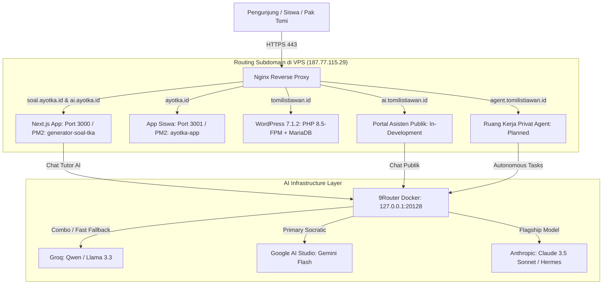

# BLUEPRINT & PROGRESS EKOSISTEM AI
## AyoTKA (`ayotka.id`) & Portal Tomi Listiawan (`tomilistiawan.id`)
*Dokumen ini dirancang khusus untuk referensi kerja agent/developer (Claude Code / Antigravity) agar mengetahui konteks menyeluruh, status teknis terkini, dan rencana aksi kelanjutan.*

---

## 1. Ringkasan Eksekutif & Peta Arsitektur

Server utama menggunakan **VPS Hostinger (KVM 2)** dengan IP `187.77.115.29` (Ubuntu 24.04 LTS, 8 GB RAM, 85 GB SSD). Semua layanan diorkestrasi menggunakan **Nginx** sebagai Reverse Proxy terpusat dan **Docker** untuk gateway AI.



---

## 2. Pemetaan Domain, Port, dan Status Layanan

| Domain / Subdomain | Target / Port | Status Saat Ini | Deskripsi & Peruntukan |
| :--- | :--- | :--- | :--- |
| **`soal.ayotka.id`** | `http://127.0.0.1:3000` | **LIVE (SSL Aktif)** | Panel Manajemen Bank Soal TKA & Generator Harian |
| **`ai.ayotka.id`** | `http://127.0.0.1:3000/tutor` | **LIVE (SSL Aktif)** | Portal Interaktif Tutor AI Belajar Siswa TKA |
| **`ayotka.id`** | `http://127.0.0.1:3001` | **LIVE (SSL Aktif)** | Aplikasi Try Out Siswa (Dikelola bersama Mas Firerza) |
| **`tomilistiawan.id`** | FastCGI `/run/php/php-fpm.sock` | **Siap di VPS (Proses Transfer)** | Website Personal WordPress (Migrasi dari Rumahweb) |
| **`ai.tomilistiawan.id`** | Next.js / Standalone | **DALAM PENGEMBANGAN (Okt 2026): landing, login Google, chat digital twin sudah dibangun di lokal; masih di Vercel, belum dipindah ke VPS** | Portal AI Publik Representasi Pak Tomi Listiawan. Detail lengkap & langkah berikutnya: `C:\AntiGravity\RPP_GENERATOR\docs\HANDOFF_AI_TOMILISTIAWAN.md` |
| **`agent.tomilistiawan.id`** | Protected Workspace | **PLANNED** | Ruang Kerja Privat AI Agent Otonom Khusus Pak Tomi |

---

## 3. Detail Fondasi AI: 9Router (Core Gateway)

* **Status:** **SUDAH TERPASANG & AKTIF** di VPS.
* **Tipe Deployment:** Docker Container (`decolua/9router:latest`).
* **Port Internal:** `127.0.0.1:20128` (tidak terekspos langsung ke internet, hanya diakses oleh backend internal).
* **Direktori Data:** `/opt/9router/data` di-mount ke `/app/data`.
* **Fungsi:**
  1. **Unified Endpoint:** Menyediakan endpoint standar OpenAI-compatible (`http://127.0.0.1:20128/v1/chat/completions`).
  2. **Combo / Multi-Model Routing:** Menerima permintaan chat, mendistribusikan ke model utama (Gemini Flash), dan melakukan *auto-failover* instan ke model cadangan (Groq/Qwen/Llama) saat terjadi rate-limit atau lonjakan trafik.
  3. **Virtual API Keys:** Mengamankan API key asli dari browser.

---

## 4. Ekosistem AI AyoTKA (`ai.ayotka.id` & `src/lib/ai/`)

### A. Tutor AI Siswa (Metode Sokrates)
* **File Utama:**
  - Service: [`src/lib/ai/tutor-service.ts`](file:///c:/AntiGravity/GENERATOR%20SOAL%20TKA/src/lib/ai/tutor-service.ts)
  - Endpoint: [`src/app/api/ai/tutor/chat/route.ts`](file:///c:/AntiGravity/GENERATOR%20SOAL%20TKA/src/app/api/ai/tutor/chat/route.ts)
  - UI Component: [`src/components/tutor/TutorAiChatModal.tsx`](file:///c:/AntiGravity/GENERATOR%20SOAL%20TKA/src/components/tutor/TutorAiChatModal.tsx)
* **Karakteristik & Pedagogi:**
  - **Socratic Pedagogy:** Tidak langsung membocorkan huruf jawaban mentah. Memandu siswa langkah demi langkah agar memahami konsep nalar soal.
  - **Dukungan 4 Mode:** `socratic` (bimbingan nalar), `solver` (trik hitung kilat), `literacy` (analisis wacana), `creator` (asisten guru penyusun soal).
  - **Aturan Wajib KaTeX:** Semua angka/rumus diapit `$..$` atau `$$..$$`. Dilarang menggunakan backtick untuk rumus matematika.
* **Status Integrasi:**
  - **Tahap 1 (9Router):** Sudah tersambung ke `http://127.0.0.1:20128/v1` dengan model `ayotka-tutor-combo`.
  - **Tahap 2 (Fallback Direct):** Jika 9Router tidak merespons dalam 25 detik, otomatis fallback langsung ke Google Gemini API via `AI_TUTOR_GEMINI_KEY`.
* **Dokumentasi Kolaborasi:**
  - Panduan integrasi tombol Tutor AI di halaman pembahasan siswa `ayotka.id` untuk Mas Firerza terdokumentasi di [`docs/INTEGRASI_TUTOR_AI_UNTUK_FIRERZA.md`](file:///c:/AntiGravity/GENERATOR%20SOAL%20TKA/docs/INTEGRASI_TUTOR_AI_UNTUK_FIRERZA.md).

---

## 5. Ekosistem TomiListiawan.id: Pembeda Utama Dua Subdomain AI

Poin kritis yang harus dipahami oleh setiap developer/agent: **`ai.tomilistiawan.id` dan `agent.tomilistiawan.id` adalah dua sistem yang berbeda tujuan dan hak aksesnya.**

```
+---------------------------------------------------------------------------------------+
|                                 DOMAIN UTAMA: tomilistiawan.id                        |
|                     (WordPress 7.1.2 Personal Website & Portfolio)                    |
+---------------------------------------------------------------------------------------+
                     │                                                 │
                     ▼                                                 ▼
+-----------------------------------------+   +-----------------------------------------+
|        ai.tomilistiawan.id              |   |       agent.tomilistiawan.id            |
|       (Public AI Representative)        |   |       (Private Autonomous Agent)        |
+-----------------------------------------+   +-----------------------------------------+
| • Akses: TERBUKA UNTUK PUBLIK / TAMU    |   | • Akses: PRIVAT (Hanya Pak Tomi)        |
| • Login: Tidak memerlukan login rumit   |   | • Login: Autentikasi ketat (Auth Guard) |
| • Fungsi: Digital Twin / Persona Pak    |   | • Fungsi: AI Agent otonom untuk tugas   |
|   Tomi untuk menjawab pertanyaan tamu   |   |   berat (coding, deep research, naskah  |
|   seputar kepakaran, riset asesmen TKA, |   |   buku, generator bank soal rahasia)    |
|   matematika, & literasi edukasi        |   | • Model: Master Key 9Router ke model    |
| • Model: Model hemat & cepat (Gemini    |   |   papan atas (Claude 3.5 Sonnet,        |
|   Flash / Qwen / Llama 3 via 9Router)   |   |   Hermes Agent, Gemini 1.5 Pro)         |
| • Desain: UI Chat profesional (ChatGPT/ |   | • Fitur: Tools calling, task scheduler, |
|   Claude style, Glassmorphism, KaTeX)   |   |   dan terminal/file automation          |
+-----------------------------------------+   +-----------------------------------------+
```

---

## 6. Status Migrasi WordPress `tomilistiawan.id`

1. **Database & File di VPS:**
   - Direktori: `/var/www/tomilistiawan.id` (ukuran ~513 MB, pemilik `www-data:www-data`).
   - Database: MariaDB database `wp_tomilistiawan` (kredensial tersimpan aman di `/root/.wp-tomilistiawan.id.db`).
   - PHP Runtime: PHP 8.5.4 FPM (`/run/php/php-fpm.sock`).
   - Keamanan Nginx: Akses ke `wp-config.php`, `debug.log`, `aiowps_backups`, dan `xmlrpc.php` diblokir (403).
   - Login Slug: Dilindungi All In One WP Security di path `/webmasuk/`.
   - Cron: WP-Cron dialihkan ke sistem cron VPS (`/etc/cron.d/wp-tomilistiawan` berjalan tiap 5 menit).
2. **Status Domain Transfer:**
   - Permohonan transfer domain dari Rumahweb ke Hostinger telah **resmi dikirim (submitted)** pada 6 Oktober 2026.
   - Menunggu periode verifikasi registrar/PANDI (5–7 hari kerja).
   - Website lama di hosting Rumahweb tetap aktif melayani pengunjung sampai nameserver berpindah.
   - Begitu transfer tuntas di Hostinger, Nginx VPS tinggal diterbitkan sertifikat SSL resmi Let's Encrypt.

### Cara Claude Code / Developer Mengakses MariaDB di VPS
MariaDB sengaja dikunci hanya mendengarkan `127.0.0.1:3306` di VPS (firewall UFW memblokir akses langsung dari internet luar demi keamanan).

* **Opsi 1 (Paling Cepat & Direkomendasikan): Gunakan Helper Script**
  Telah disediakan script helper [scripts/db-query.ts](file:///c:/AntiGravity/GENERATOR%20SOAL%20TKA/scripts/db-query.ts) yang otomatis membaca kredensial VPS dari `.env.local` dan mengeksekusi SQL secara aman lewat SSH:
  ```bash
  # 1. Operasi CRUD Penuh (Create Table/Insert, Read/Select, Update, Delete):
  npx tsx scripts/db-query.ts "SELECT option_name, option_value FROM rfxeo_options WHERE option_name = 'blogname';"
  npx tsx scripts/db-query.ts "INSERT INTO nama_tabel (kolom) VALUES ('nilai');"
  npx tsx scripts/db-query.ts "UPDATE nama_tabel SET kolom = 'baru' WHERE id = 1;"
  npx tsx scripts/db-query.ts "DELETE FROM nama_tabel WHERE id = 1;"

  # 2. Operasi Level ROOT (Bisa CREATE DATABASE, SHOW DATABASES, CREATE USER):
  npx tsx scripts/db-query.ts --root "SHOW DATABASES;"
  npx tsx scripts/db-query.ts --root "CREATE DATABASE IF NOT EXISTS database_baru;"

  # 3. Output Raw / Tab-Delimited (untuk parsing skrip otomatis):
  npx tsx scripts/db-query.ts --raw "SELECT * FROM rfxeo_users;"

  # 4. Penggunaan Programatik di TypeScript/Node.js:
  # import { queryDb } from "./scripts/db-query";
  # const result = await queryDb("SELECT * FROM rfxeo_posts LIMIT 5;");
  ```
* **Opsi 2: Eksekusi Langsung via WP-CLI di SSH**
  ```bash
  ssh root@187.77.115.29 "wp db query 'SHOW TABLES;' --path=/var/www/tomilistiawan.id --allow-root"
  ```
* **Opsi 3: SSH Port Tunneling (Untuk GUI DBeaver / TablePlus / MySQL Client)**
  Buka tunnel dari terminal lokal:
  ```bash
  ssh -N -L 3306:127.0.0.1:3306 root@187.77.115.29
  ```
  Lalu connect client lokal ke `127.0.0.1:3306` (Database: `wp_tomilistiawan`, User/Pass tersimpan di VPS pada `/root/.wp-tomilistiawan.id.db`).

---

## 7. Roadmap & Rencana Aksi Berikutnya

### Target Fase 1: Membangun Antarmuka `ai.tomilistiawan.id`
1. **Frontend Architecture:**
   - Menggunakan Next.js App Router (dapat diintegrasikan langsung pada codebase ini di route khusus atau hostname matcher).
   - Tampilan setara Claude / ChatGPT:
     - Sidebar riwayat obrolan (disimpan di `localStorage` atau session DB).
     - Area obrolan dengan animasi responsif (typing/streaming effect).
     - Dukungan rendering Math (KaTeX) & Markdown kaya.
     - Pilihan preset topik: *"Konsultasi Riset Pendidikan"*, *"Metodologi Asesmen TKA"*, *"Tanya Profil & Karya Pak Tomi"*.
2. **Backend Persona Prompting:**
   - Persona representatif: Bijak, akademis, ramah, menguasai standar asesmen pendidikan nasional (Pusmendik/Kemendikdasmen RI), matematika terapan, dan inovasi edukasi.
3. **Nginx & Subdomain Configuration:**
   - Menyiapkan file konfigurasi vhost Nginx `/etc/nginx/sites-available/ai.tomilistiawan.id`.

### Target Fase 2: Mempersiapkan Fondasi `agent.tomilistiawan.id`
1. Menentukan arsitektur antarmuka (Open-WebUI container atau custom agent cockpit).
2. Konfigurasi Master Key 9Router dengan kuota khusus model penalaran tingkat tinggi (Claude 3.5 Sonnet / Gemini Pro).
3. Pemasangan layer login/autentikasi privat.

---

## 8. Panduan Teknis & Keamanan untuk Claude Code / Developer

1. **JANGAN PERNAH Mencetak / Hardcode Kredensial:**
   - Semua rahasia tersimpan di `.env.local` lokal dan `/var/www/generator-soal-tka/.env.local` di VPS.
   - Kredensial database WordPress tersimpan di `/root/.wp-tomilistiawan.id.db`.
2. **Pertahankan Port & Service Eksisting:**
   - Jangan mematikan atau mengubah konfigurasi PM2 `generator-soal-tka` (port 3000) dan `ayotka-app` (port 3001).
   - 9Router berjalan di Docker container bernama `9router` pada port `127.0.0.1:20128`.
3. **Penyimpanan Gambar Soal:**
   - Gambar soal berada di `/var/www/generator-soal-tka/public/soal-images/` dan dilayani langsung oleh alias Nginx. Jangan hapus folder ini.
